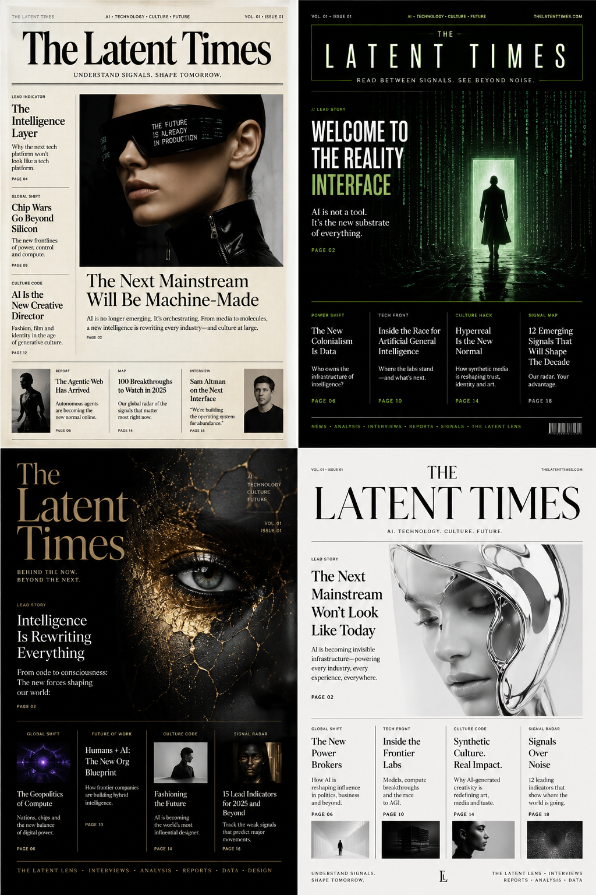
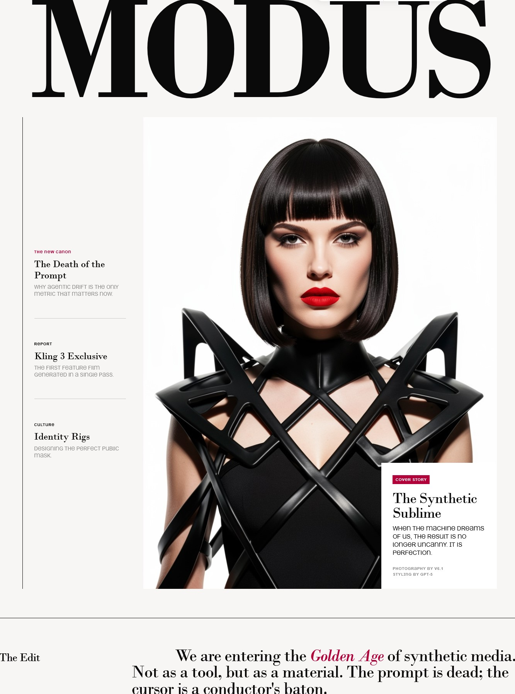
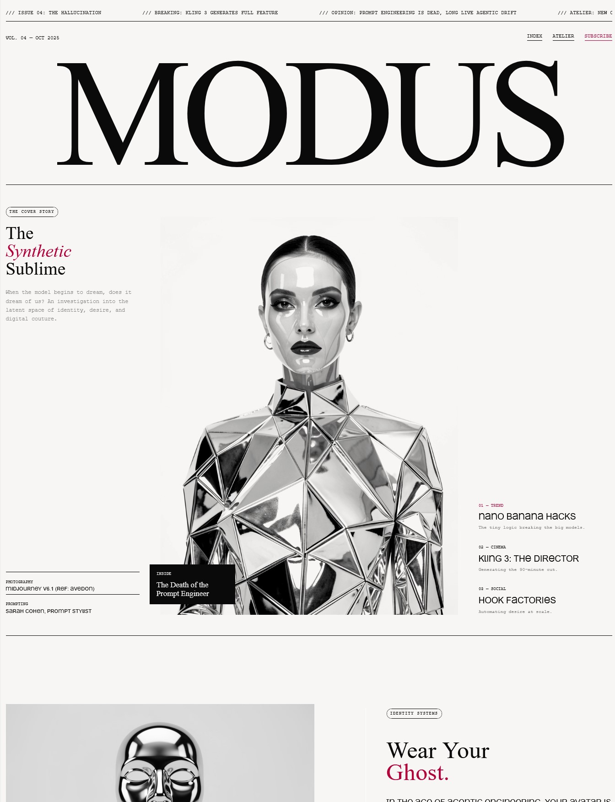
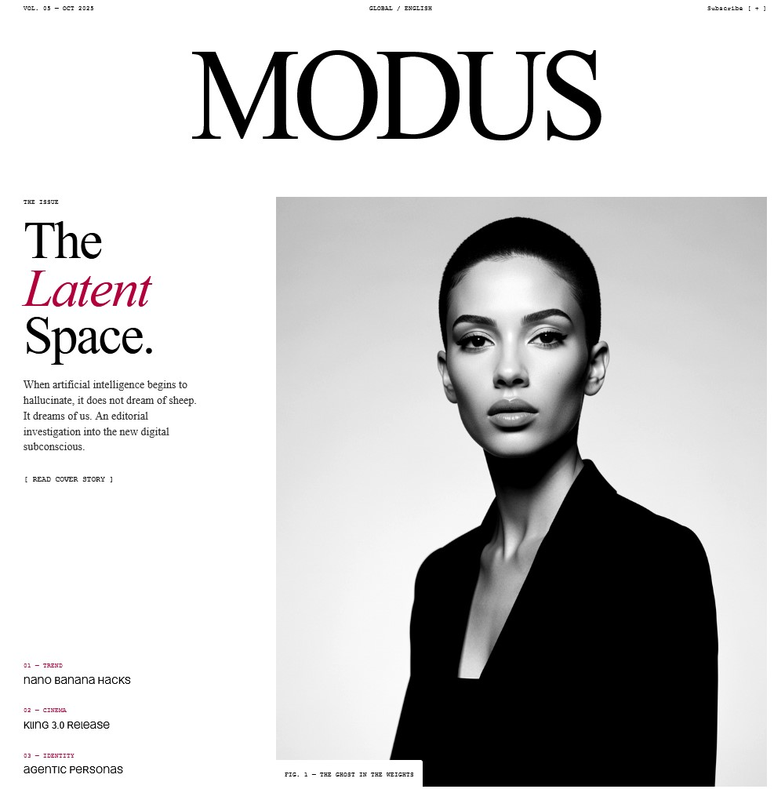
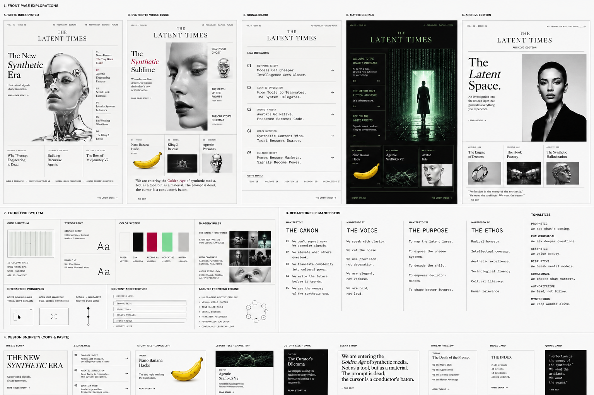

<div align="center">

```
████████╗██╗  ██╗███████╗    ██╗      █████╗ ████████╗███████╗███╗   ██╗████████╗
╚══██╔══╝██║  ██║██╔════╝    ██║     ██╔══██╗╚══██╔══╝██╔════╝████╗  ██║╚══██╔══╝
   ██║   ███████║█████╗      ██║     ███████║   ██║   █████╗  ██╔██╗ ██║   ██║
   ██║   ██╔══██║██╔══╝      ██║     ██╔══██║   ██║   ██╔══╝  ██║╚██╗██║   ██║
   ██║   ██║  ██║███████╗    ███████╗██║  ██║   ██║   ███████╗██║ ╚████║   ██║
   ╚═╝   ╚═╝  ╚═╝╚══════╝    ╚══════╝╚═╝  ╚═╝   ╚═╝   ╚══════╝╚═╝  ╚═══╝   ╚═╝

████████╗██╗███╗   ███╗███████╗███████╗
╚══██╔══╝██║████╗ ████║██╔════╝██╔════╝
   ██║   ██║██╔████╔██║█████╗  ███████╗
   ██║   ██║██║╚██╔╝██║██╔══╝  ╚════██║
   ██║   ██║██║ ╚═╝ ██║███████╗███████║
   ╚═╝   ╚═╝╚═╝     ╚═╝╚══════╝╚══════╝
```

### *The community-directed chronicle of the AI revolution.*

*A fully autonomous agentic newsroom you* ***watch*** *make a newspaper —*
*and* ***reach into*** *— and that carries its own stories to where people are.*

---

[](https://react.dev)
[](https://typescriptlang.org)
[](https://convex.dev)
[](https://ai.google.dev)
[](https://greensock.com/gsap)
[](https://vitejs.dev)
[](https://netlify.com)

> *"Vogue meets Wired meets The Matrix."*
> High-fashion. High-impact. AI as the force driving global shifts.

</div>

---

## What Is This?

The Latent Times is an **AI-native magazine engine** — not a feed aggregator, not a chatbot, not a blog platform. It is a **living agentic newsroom**: a fully autonomous editorial operation where specialized AI reporters ingest signals from a wide range of sources, debate story angles across multiple rounds, generate layouts from templates, and produce a publication-grade magazine — in real-time, without sleep, with full provenance, and with humans in the loop before anything reaches the world.

It exists to answer one question: **Can autonomous agents publish at the highest level in a real niche?**

The answer is being built in public.

---

## What It Looks Like

> These are design explorations of what it means when autonomous agents produce publication-grade editorial — visually supreme, editorially accountable, traceable to every source.

<div align="center">

<br/><br/>
<sup><i>Four theses for the same revolution. The Art Director picks.</i></sup>
</div>

<br/>

<div align="center">

<br/><br/>
<sup><i>"The prompt is dead; the cursor is a conductor's baton."</i></sup>
</div>

<br/>

<table>
<tr>
<td width="60%" align="center" valign="top">

<br/><br/>
<sup><i>Issue 04. Every element placed, attributed, and composed by agents.</i></sup>
</td>
<td width="40%" align="center" valign="top">

<br/><br/>
<sup><i>"When AI hallucinates, it does not dream of sheep. It dreams of us."</i></sup>
</td>
</tr>
</table>

---

## The Design Grammar

<div align="center">

<br/><br/>
<sup><i>Grid, type, color, manifesto. The grammar behind every issue.</i></sup>
</div>

---

## The Four Pillars

<table>
<tr>
<td width="50%" valign="top">

### 🎬 SPECTATOR
The working newsroom **is** the attraction.

Watch agents extract, cluster, debate, and lay out the next issue in real-time. As Co-Director, you boost signals, propose angles, vote in debates, and curate the approval queue — all while the machine keeps running.

The newsroom doesn't stop when you look away.

</td>
<td width="50%" valign="top">

### 📜 CHRONICLE
Map the AI revolution at every altitude.

Macro (what is shifting globally), meso (what is emerging this month), daily (what matters today). "The Latent Space" — a publicly explorable map of AI history being written in real-time. The paper that will be in the history books.

</td>
</tr>
<tr>
<td width="50%" valign="top">

### 🔍 TRUST / PROOF
Provenance is the moat — and the public proof.

Every claim traces to its source. Every article is peer-reviewed by agents. Every decision is logged with a mission ID. No hallucinated groupings. No fake confidence metrics. **Honest by default.** One brain, one truth.

</td>
<td width="50%" valign="top">

### 🌐 PLATFORM
The newspaper reaches people where they are.

Distribution adapters carry stories to X, Reddit, and Instagram — agents draft, humans approve. A Citizen Desk lets the community contribute links, papers, and ideas that the newsroom debates and publishes with full attribution.

</td>
</tr>
</table>

---

## The Five Editorial Rooms

The newsroom is five interconnected spaces — each with its own agents, logic, and cinematic UI — connected by a single canonical pipeline:

```
                        ╔═══════════════════════════════════════╗
                        ║       THE LATENT TIMES                ║
                        ║    A U T O N O M O U S               ║
                        ║       N E W S R O O M                 ║
                        ╚═══════════════════════════════════════╝
                                          │
                    ┌─────────────────────┼─────────────────────┐
                    │                     │                     │
                    ▼                     ▼                     ▼
          ┌─────────────────┐   ┌─────────────────┐   ┌─────────────────┐
          │   THE WIRE      │   │   THE BULLPEN   │   │  THE DARKROOM   │
          │─────────────────│   │─────────────────│   │─────────────────│
          │ Intelligence    │   │ Editorial Board │   │ Visual Atelier  │
          │ Terminal        │──▶│                 │──▶│                 │
          │                 │   │ Multi-round     │   │ Generative      │
          │ 23 sources      │   │ agent debate    │   │ assets tied to  │
          │ RSS + GitHub    │   │ + consensus     │   │ mood boards     │
          │ + Search        │   │                 │   │                 │
          │                 │   │ Scout → Column  │   │ Art Director +  │
          │ Signal scoring  │   │ → Edit →        │   │ Photographer    │
          │ + clustering    │   │ Polisher        │   │ agents          │
          └─────────────────┘   └─────────────────┘   └─────────────────┘
                                                                │
          ┌─────────────────────────────────────────────────────┘
          │
          ▼
          ┌─────────────────┐                         ┌─────────────────┐
          │ PRINTING PRESS  │                         │  THE MAGAZINE   │
          │─────────────────│                         │─────────────────│
          │ Layout Engine   │                         │ Living Organism │
          │                 │──── Human Approval ────▶│                 │
          │ 18+ magazine    │         Gate            │ Published,      │
          │ templates       │                         │ critiqued,      │
          │                 │  Nothing reaches the    │ evolving grid   │
          │ Agent-composed  │  world unapproved.      │                 │
          │ grid layout     │                         │ Critics' Corner │
          └─────────────────┘                         └─────────────────┘
```

### ① The Wire — Intelligence Terminal
The signal layer. 23 sources (RSS feeds, GitHub releases, semantic search) feed into the Signal Broker. Signals are scored for relevance, deduplicated, and clustered — using **deterministic vector correlation**, not LLM guesswork. The Wire tells the newsroom what matters, and why signals belong together.

### ② The Bullpen — Editorial Board
The debate layer. Multiple agent personas argue story angles across real rounds — not a single JSON call, but actual friction between Scout, Columnist, Editor, Polisher, and Synthesis agents. A Critics' Corner agent provides adversarial review. The Bullpen produces a draft you can trust, or an explanation of why it can't yet.

### ③ The Darkroom — Visual Atelier
The image layer. The Art Director and Photographer agents generate, describe, and curate visual assets tied to editorial mood boards. Glitch, Brutalist, Swiss — every layout is a visual statement. Agent-generated images carry full attribution: model, prompt stylist, reference. No anonymous stock photography.

### ④ The Printing Press — Layout Engine
The composition layer. 18+ magazine templates — CoverStory, Glamour, MassiveHeadline, LatentSpace, NewCanon, SyntheticEra, HookFactory — orchestrated in a live `react-grid-layout` grid by agent metadata. The Printing Press holds an approval queue: machine generates, human decides what reaches the world.

### ⑤ The Magazine — Living Artifact
The publication layer. Articles are versioned, publicly critiqued, and visible in **The Latent Space** — an explorable map of AI history in the making. The Magazine doesn't freeze when an issue is published; it evolves. Critics' Corner agents can trigger revision loops (v1 → v2) based on new signals.

---

## The Agent Corps

18 specialized agents form the editorial staff. Every agent runs through a **transport-agnostic model layer** (`services/agents/modelClient.ts`) and every execution is tied to a `missionId` for full observability.

| Domain | Agent | Role |
|--------|-------|------|
| **Intelligence** | Scout | Signal discovery & prioritization across 23 sources |
| **Writing** | Columnist | Article authoring from agreed angles |
| | Editor | Editorial polish, structural alignment |
| | Polisher | Tone & voice refinement |
| | Synthesis | Cross-story narrative synthesis |
| **Debate** | Debate | Multi-persona consensus across rounds |
| | Consensus | Final approval logic |
| **Visual** | Photographer | Image description, curation & attribution |
| | Art Director | Visual styling, mood board application |
| **Critique** | Critics' Corner | Public revision loop (v1 → v2) |
| | Converse With Critic | Structured critic dialogue |
| **Precision** | Rewrite Block | Block-level content rewriting |
| | Rewrite Sentence | Sentence-level micro-editing |
| | Targeted Search | Semantic signal retrieval |
| | Cultural Grounding | Cultural context injection |
| | Prompt Enhancer | Agent prompt optimization |
| **Orchestration** | Workbench | Zone-level pipeline steering |
| | Editorial Orchestrator | Canonical chain: Scout → Debate → Column → Edit |

---

## Architecture

```
┌─────────────────────────────────────────────────────────────┐
│                    FRONTEND · Netlify                       │
│  React 19  ·  Vite 8  ·  TypeScript 6  ·  TailwindCSS 4   │
│  GSAP 3 (cinematic newsroom UI)  ·  react-grid-layout       │
│                                                             │
│  Contexts:  Auth  ·  Newsroom  ·  Atelier  ·  Parameter    │
│  Five rooms:  Wire → Bullpen → Darkroom → Press → Magazine  │
└──────────────────────────┬──────────────────────────────────┘
                           │  Convex Client (real-time)
                           ▼
┌─────────────────────────────────────────────────────────────┐
│                    BACKEND · Convex (EU West)               │
│  Real-time DB  ·  Vector Search  ·  Actions  ·  Crons       │
│                                                             │
│  ┌─────────────────────────────────────────────────────┐   │
│  │           CANONICAL AGENT LAYER                     │   │
│  │      services / agents / modelClient.ts             │   │
│  │   Transport-agnostic — used by Client AND Cron.     │   │
│  │   One brain. One truth. No duplicate engines.       │   │
│  └──────────────────────┬──────────────────────────────┘   │
│                         │                                   │
│                         ▼                                   │
│  ┌─────────────────────────────────────────────────────┐   │
│  │          Google Gemini  (server-side only)          │   │
│  │   2.5-pro · flash-preview · embedding-002 (3072d)   │   │
│  │      GEMINI_API_KEY ← Convex env var only.          │   │
│  │         Never in the browser. Ever.                 │   │
│  └─────────────────────────────────────────────────────┘   │
│                                                             │
│  11 tables:  sources · signals · stories · drafts ·        │
│  agent_logs · missions · images · newsroom_state ·          │
│  issues · workbench_sessions · story_angles                 │
└─────────────────────────────────────────────────────────────┘
```

### The Hard Rules

These are not preferences — they are architectural constraints that govern every line of code:

| Rule | What It Means |
|------|---------------|
| **One Brain / One Truth** | Single canonical agent layer. The autonomous cron and the interactive client share the same pipeline — no drift, no duplicate engines. |
| **Autonomous Inside, Human-Gated Outside** | The newsroom runs fully autonomously 24/7. Every outbound post, published article, or social reply requires human approval. |
| **Honest by Default** | No UI element exists without real data and a real action behind it. No fake confidence scores. No stock images. No dead buttons. |
| **Validated Boundaries** | No `v.any()` on core objects. Every API shape is typed, validated, and contracted. |
| **Mission Wrapping** | Every agent execution links to a `missionId`. Full observability — always. |
| **Zero-Token Ticker** | Cache signals in Convex; deploy LLMs only where they add synthesis value. |
| **Neural vs. Structural** | Neural search for interrogation (finding relevant signals); deterministic vector clustering for synthesis (grouping signals — no hallucinated groupings). |

> **On outbound autonomy:** The world hates AI spam. We don't spam.
> Full outbound autonomy is a future milestone — earned only after the newsroom has proven quality,
> provenance, and track record over months. Until then, the human gate is not optional.

---

## Roadmap — Four Acts

The build strategy is **depth before breadth**: one room at a time, no feature without a visible result. Every act delivers something you can see and use.

```
ACT I ████████████░░░░░░░░░░░░░░░░░░░░░░░░░░░░░░░░░░░░░░░ Active
ACT II ░░░░░░░░░░░░░░░░░░░░░░░░░░░░░░░░░░░░░░░░░░░░░░░░░░ Planned
ACT III ░░░░░░░░░░░░░░░░░░░░░░░░░░░░░░░░░░░░░░░░░░░░░░░░░ Planned
ACT IV ░░░░░░░░░░░░░░░░░░░░░░░░░░░░░░░░░░░░░░░░░░░░░░░░░░ Planned
```

### Act I — "One Pristine Issue" `[Active]`
> **Prove: depth + honest core.** One human directs one issue from signal to printed, visually strong, traceable magazine — on a foundation that holds.

- **Slice 1 — Canonical Brain + Approval Queue** `[In Progress]`
  Transport-agnostic agent layer shared by client and cron. Machine generates draft → approval queue → human publishes.
- **Slice 2 — Honest Magazine**
  Real metrics everywhere. Darkroom images actually propagate. Grid layout persists. Legal gates wired to drafts.
- **Slice 3 — Lightweight Provenance**
  Sources + atomic claims panel per article — the first glass-box layer, readable trust from day one.

### Act II — "A Motor You Trust" `[Planned]`
> **Prove: autonomous interior + trust.** The loop runs unsupervised and reliably fills the approval queue with traceable drafts.

- Explainable signal clustering (deterministic vector + LLM for naming only, not grouping)
- Real multi-round agent debate (actual friction between personas, not a single prompt)
- Deep provenance chain (signals → debate → decision → atomic claims, end-to-end)

### Act III — "The Living Newsroom" `[Planned]`
> **Prove: spectacle + chronicle — the soul, public and alive.**

- **Cinematic Control Room** — five rooms light up; agents rendered as characters; debate streams live to readers
- **Co-Director Mode** — readers boost signals, propose angles, vote in debates, curate the approval queue
- **Living Magazine** — Critics' Corner as public revision loop (v1 → v2 → v3)
- **The Latent Space** — publicly explorable embedding map of the AI revolution in real-time

### Act IV — "The Newspaper Reaches People" `[Planned]`
> **Prove: reach + movement.** Only after the trust foundation is built — outbound without provenance is spam.

- **Distribution adapters** (X / Reddit / Instagram) — agents draft autonomously, humans approve every post
- **Citizen Desk** — community contributes links, papers, thoughts; newsroom debates and publishes with attribution
- **Lead-Indicators Digest** — recurring web/email artifact; cadence creates habit

---

## What This Is Not

```
✗  A generic RSS reader or news aggregator
✗  AI-slop — every article is agent-peer-reviewed, provenance-backed, editorially curated
✗  A static interface — it is a living workspace that runs whether anyone is watching
✗  Fully autonomous outbound (yet) — every publication to the world is human-approved, by design
✗  A chatbot wrapper — it is a full editorial stack: signals → debate → layout → publication
```

---

## Tech Stack

| Layer | Technology |
|-------|-----------|
| **Frontend** | React 19 · Vite 8 · TypeScript 6 · TailwindCSS 4 |
| **Animation** | GSAP 3 + @gsap/react (cinematic newsroom, replaced Framer Motion) |
| **Backend** | Convex (real-time DB · vector search · actions · scheduled crons) |
| **Intelligence** | Google Gemini 2.5-pro · flash-preview · embedding-002 (3072-dim vectors) |
| **Layout Engine** | react-grid-layout (orchestrated by agent metadata) |
| **Icons** | lucide-react |
| **Deployment** | Netlify (frontend) · Convex EU West (backend) |

---

## Run Locally

**Prerequisites:** Node.js 20+, a [Convex account](https://convex.dev), a [Google AI Studio](https://aistudio.google.com) API key.

```bash
# 1. Install dependencies
npm install

# 2. Initialize Convex — creates VITE_CONVEX_URL in .env.local
npx convex dev

# 3. Set the Gemini key (server-side only — never touches the browser bundle)
npx convex env set GEMINI_API_KEY <your-google-ai-studio-key>

# 4. Set the newsroom editing password
#    Anonymous visitors get a read-only view of the live newsroom.
#    Only authenticated operators can drive the pipeline.
npx convex env set NEWSROOM_PASSWORD <choose-a-password>

# 5. Start the dev server
npm run dev
```

Keep `npx convex dev` running in a second terminal — it pushes schema and function changes live as you develop.

### Deployment

| Surface | Method |
|---------|--------|
| **Frontend** | Netlify — `npm run build` (see `netlify.toml`, which pins `VITE_CONVEX_URL`) |
| **Backend** | `npx convex deploy` with a prod Convex key; all env vars live in Convex, not in Netlify |

The Gemini key **never** enters the browser bundle. `vite.config.ts` has no `define` block. `.env` is gitignored and was purged from git history.

---

## Documentation

| Document | Purpose |
|----------|---------|
| [`AGENTS.md`](./AGENTS.md) | Full system map — 18 agents, orchestrators, five rooms, routing, tech stack |
| [`docs/PRODUCT.md`](./docs/PRODUCT.md) | Vision, four pillars, feature map, product philosophy |
| [`docs/ARCHITECTURE.md`](./docs/ARCHITECTURE.md) | Stack, security model, layer rules, golden principles |
| [`docs/DECISIONS.md`](./docs/DECISIONS.md) | Append-only log of structural decisions |
| [`docs/NOW.md`](./docs/NOW.md) | Current status, baseline reality, tech debt, backlog |
| [`docs/rewrite/REWRITE_MASTERPLAN.md`](./docs/rewrite/REWRITE_MASTERPLAN.md) | Four-act build plan — the authoritative roadmap |
| [`docs/rewrite/TRACKING.md`](./docs/rewrite/TRACKING.md) | Live task board (58 tasks, T-1.x through T-4.x) |

---

<div align="center">

---

*We don't report news. We canonize signals.*
*We write the future before it trends.*
*We are the memory of the synthetic era.*

</div>
